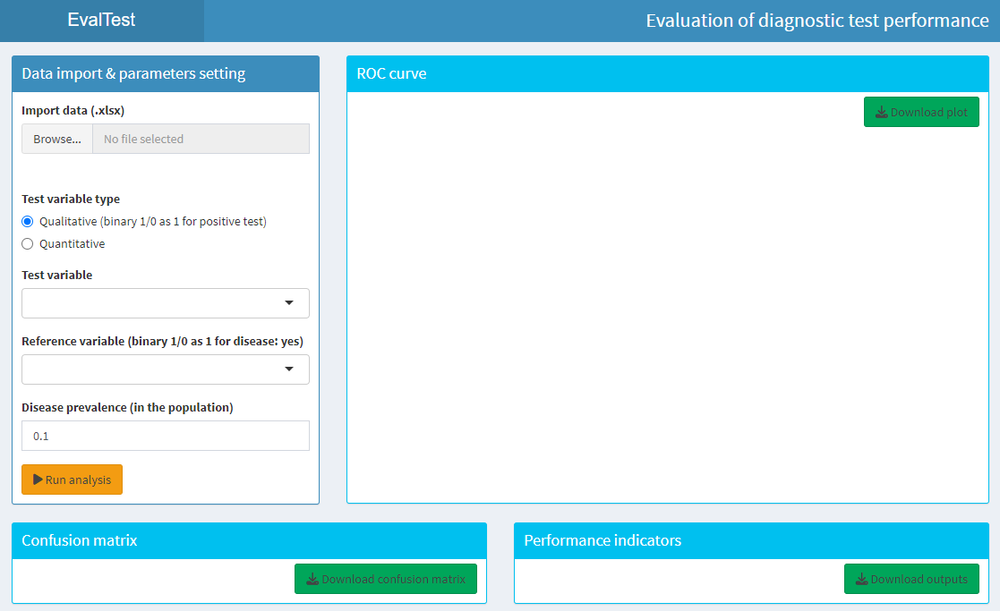
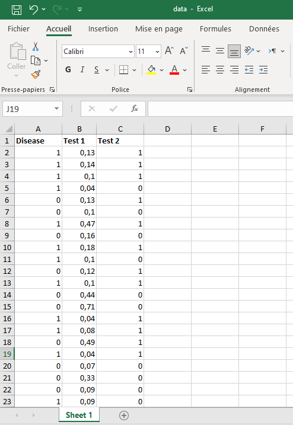
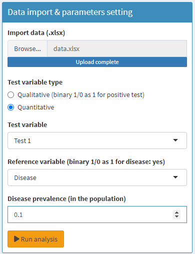
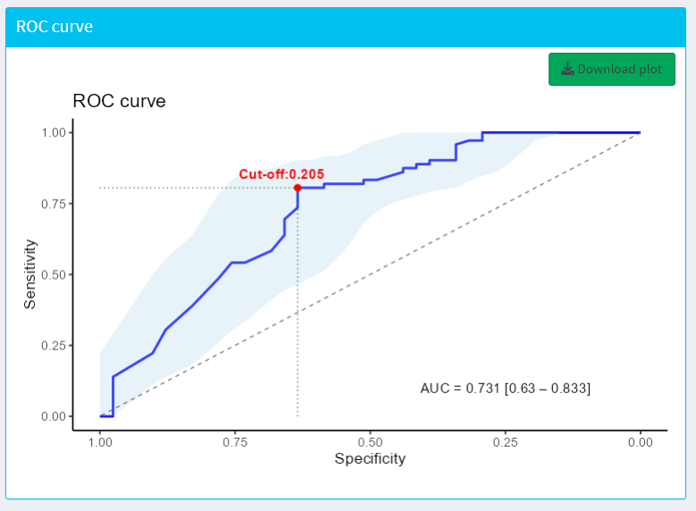
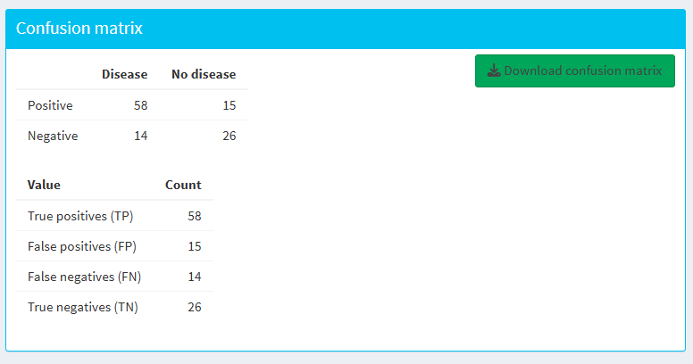
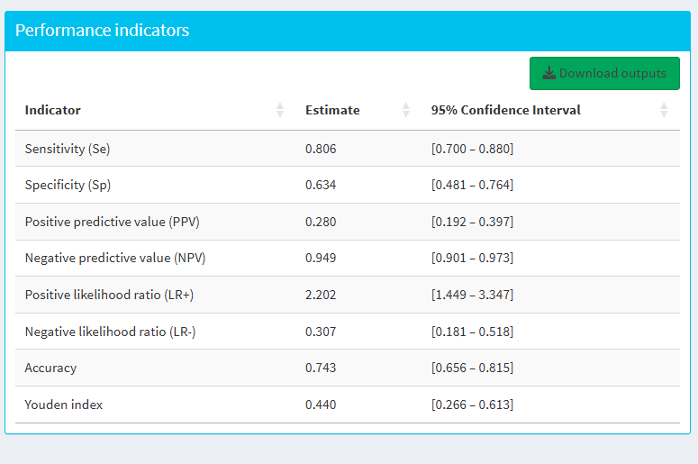

```{r, include = FALSE}
knitr::opts_chunk$set(
  collapse = TRUE,
  comment = "#>"
)
```

## Introduction to EvalTest

The 'EvalTest' package provides a 'Shiny' application for evaluating diagnostic test performance using data from laboratory or diagnostic research. It supports both binary and continuous test variables. It allows users to compute key performance indicators with their confidence interval and visualize Receiver Operating Characteristic (ROC) curves, determine optimal cut-off thresholds, display confusion matrix, and export publication-ready plot. It aims to facilitate the application of statistical methods in diagnostic test evaluation by healthcare professionals.

## Installation

You can install the development version of 'EvalTest' from GitHub like so:

```{r install_github, eval = FALSE}
devtools::install_github("NassimAyad87/EvalTest", dependencies = TRUE)
```

Or from CRAN (after the package is published there):

```{r setup, eval = FALSE}
install.packages("EvalTest", dependencies = TRUE)
```

## Launching the Application

After installing the package, you can launch the application following these steps:

```{r library_call, eval = FALSE}
library(EvalTest)
```

```{r launch, eval = FALSE}
run_app() 
```

This will open the 'Shiny' application in your default web or your RStudio viewer.

```{r display_app, eval = TRUE, echo=FALSE, out.width= "80%"}

```

## Using the Application

The application is designed to be user-friendly and intuitive. Here are the steps to use it:

-   Before uploading your data, you should ensure that the test variable is in one column (either qualitative 1/0 or quantitative) and the reference variable (disease status) is in another column (binary: 1/0), and there are no missing values in the selected columns.

```{r display_data, eval = TRUE, echo=FALSE, out.width= "80%"}

```

-   Upload your data in Excel format (.xlsx) by pressing the Browse button in the Data import and parameters setting panel.

-   Choose your variable test type (Qualitative binary 1/0 or Quantitative).

-   Select the appropriate columns for test variable and reference variable (disease status).

-   Input disease prevalence value of the study population (number between 0 and 1).

```{r display_setting, eval = TRUE, echo=FALSE, out.width= "80%"}

```

-   Run the analysis and explore the results in the different tabs.

-   You can download the ROC plot and the results tables for your report.

We can see below some screenshots of the different tabs of the application. 
We have ROC curve with its confidence interval, optimal cut-off point of test variable, AUC value and its confidence interval, and projection of best sensitivity and specificity according to the top-left method. We can also download the plot in PNG format.

```{r display_plot, eval = TRUE, echo=FALSE, out.width= "80%"}

```

We have also the confusion matrix where test variable was dichotomized to binary variable (positive/negative test) according the best cut-off point, with the counts of true positives, false positives, true negatives, and false negatives. We can download it in Excel file format.

```{r display_matrix, eval = TRUE, echo=FALSE, out.width= "80%"}

```

We have all computed performance indicators with their estimate and confidence intervals built according to Wilson method. 

```{r display_indicators, eval = TRUE, echo=FALSE, out.width= "80%"}

```

## Citation

If you use 'EvalTest' in your research, please cite it as follows:

```{r citation, eval = FALSE}
citation("EvalTest")
```

